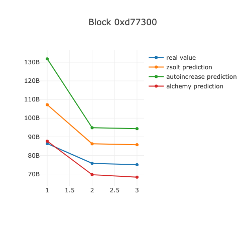
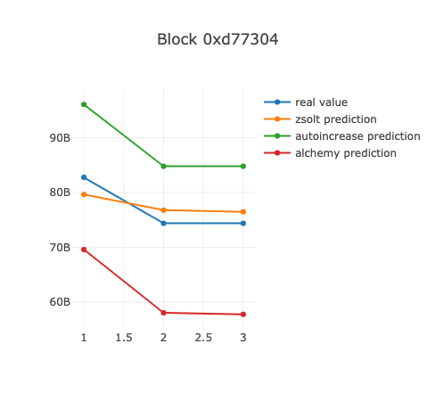

# foracle
EIP-1599 fee oracle comparison tool for different oracle algorithms.

We run the predictors against the latest `NUM_BLOCKS` blocks and compare to the result of pending block once it is confirmed. The results are shown as plots for comparison.

Currently `foracle` is implementing the following preidictors:
- [Zsolt](./zsolt.js), based on https://github.com/brave/ethereum-remote-client/blob/master/app/scripts/controllers/network/eip1559FeeOracle.js
- [Alchemy](./alchemy.js), based on https://docs.alchemy.com/alchemy/guides/eip-1559/gas-estimator
- [Auto increase](./auto_increase.js), see file for comments

### How to run it

```
  $ NET_ENDPOINT="https://mainnet.infura.io/v3/xyz" node index.js 
```

### Results

The result is a plot generated by [nodeplotlib](https://github.com/ngfelixl/nodeplotlib). The `x` axis is `[1, 2, 3]`, which corresponds to `[fast, avg, slow]` predictions.





